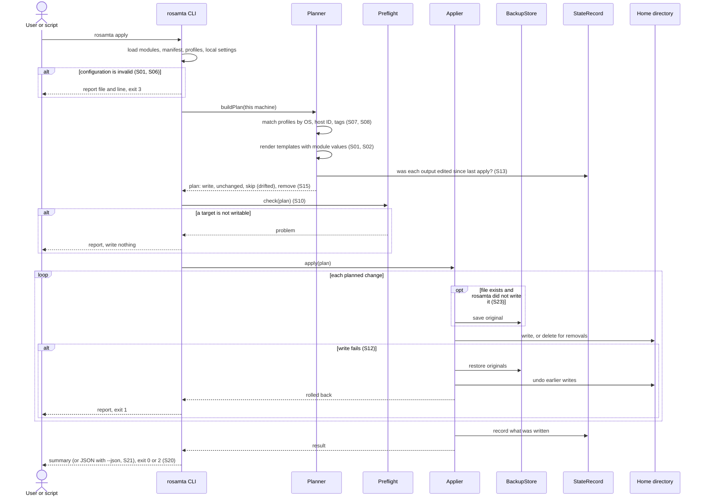

# Sequence diagram: apply

What happens when the user or a script runs `rosamta apply`. Story numbers show where each step comes from.

```mermaid
sequenceDiagram
  actor U as User or script
  participant CLI as rosamta CLI
  participant P as Planner
  participant PF as Preflight
  participant A as Applier
  participant B as BackupStore
  participant S as StateRecord
  participant FS as Home directory

  U->>CLI: rosamta apply
  CLI->>CLI: load modules, manifest, profiles, local settings
  alt configuration is invalid (S01, S06)
    CLI-->>U: report file and line, exit 3
  end
  CLI->>P: buildPlan(this machine)
  P->>P: match profiles by OS, host ID, tags (S07, S08)
  P->>P: render templates with module values (S01, S02)
  P->>S: was each output edited since last apply? (S13)
  P-->>CLI: plan: write, unchanged, skip (drifted), remove (S15)
  CLI->>PF: check(plan) (S10)
  alt a target is not writable
    PF-->>CLI: problem
    CLI-->>U: report, write nothing
  end
  CLI->>A: apply(plan)
  loop each planned change
    opt file exists and rosamta did not write it (S23)
      A->>B: save original
    end
    A->>FS: write, or delete for removals
    alt write fails (S12)
      A->>B: restore originals
      A->>FS: undo earlier writes
      A-->>CLI: rolled back
      CLI-->>U: report, exit 1
    end
  end
  A->>S: record what was written
  A-->>CLI: result
  CLI-->>U: summary (or JSON with --json, S21), exit 0 or 2 (S20)
```
